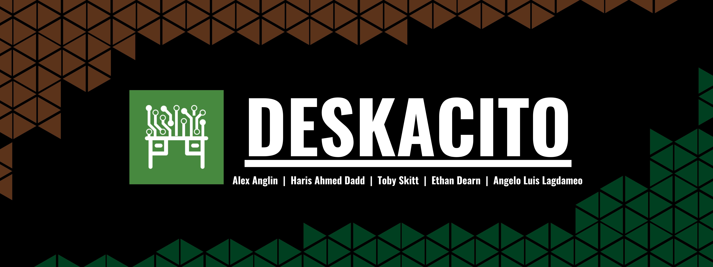
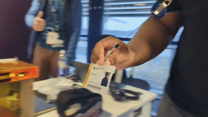
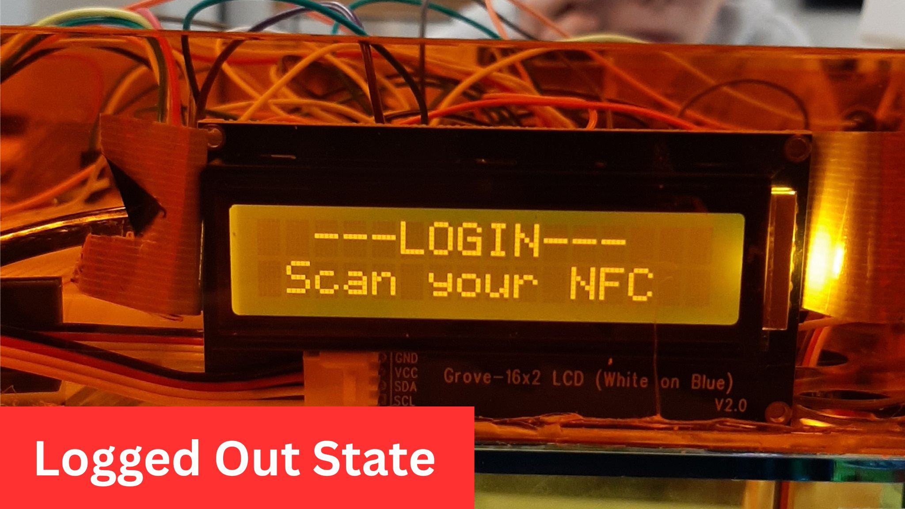
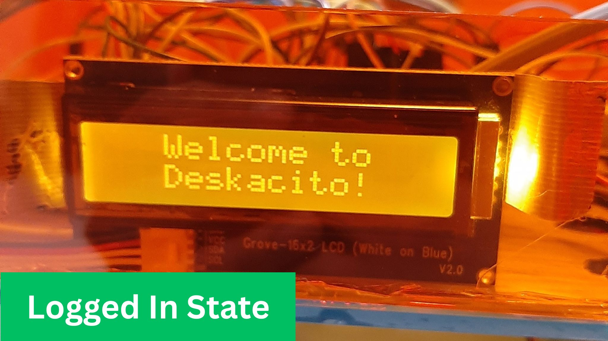

  

### <ins>Project Name</ins>
Deskacito - Smart Desk Project for BCU Innovation Fest 2024

### <ins>Project Duration</ins>
Jan 2024 - May 2024

### <ins>Hardware and Software</ins>
  - <ins>Hardware:</ins>
    - Breadboard (2×)
    - Arduino UNO R3
    - NFC Reader
    - NFC Card (4×)
    - NFC Tag (2×)
    - Small Servo Motors (2×)
    - LCD
    - LED (2×)
    - Buzzer
    - HC-SR04 Ultrasonic Sensor
    - Raspberry Pi 4 Model B
    - Raspberry Pi Camera Module 3
  - <ins>Software:</ins>
    - [Arduino IDE](https://www.arduino.cc/en/software/#ide)
    - [Visual Studio Code](https://code.visualstudio.com/download)
    - [RealVNC Viewer](https://www.realvnc.com/en/connect/download/?lai_vid=53nXRNBMPFN2&lai_sr=15-19&lai_sl=l)
    - Microsoft 3D Builder

### <ins>Members:</ins>
- Haris Ahmed Dadd
  - [LinkedIn](https://www.linkedin.com/in/haris-ahmed-dadd/)
- Ethan Dearn
  - [LinkedIn](https://www.linkedin.com/in/ethan-dearn-682680273/)
- Toby Skitt
  - [LinkedIn](https://www.linkedin.com/in/toby-skitt/)
- Alex Anglin
  - [LinkedIn](https://www.linkedin.com/in/alex-anglin-4052102a7/)
- Angelo Luis Lagdameo
  - [LinkedIn](www.linkedin.com/in/angelo-luis-lagdameo)

# What is this Project?
Deskacito is education-based project that has been developed as part of the Innovation Project Module of the BSc Computer Science course at Birmingham City University. In the span of January to May of 2024, a team of four devised the idea of developing on the current design and functions of the modern day desk by creating a "Smart Desk" that would help benefit the current environment of a work office in order to enhance the levels of productivity being within it, as well as attempting to eliminate the possibility of work theft from occurring through the utilisation and implementation of a mixture of hardware and software for certain features.

  

## Features
1. <ins>NFC-Based Login</ins>
 Imagining from a perspective where Deskacito is a mass-producible product, every copy of Deskacito will have its own pre-programmed NFC card that comes with it that will only be able to enable the owner of the desk to access it with that specific card. By scanning this card on the appropriate NFC reader area, Deskacito will be in a state where the user is privileged to store or access the contents of each compartment of the desk. Scanning the NFC card again will make the desk revert back to the state of requiring the correct NFC card to access it. Scanning a different NFC card or tag will deny access to the privileged state.

  

 

  
  

 

2. <ins>Proximity Sensor</ins>
 Even before scanning your unique NFC card, Deskacito will need to detect the user is sitting at the desk, which is detected through a HC-SR04 Ultrasonic Sensor propped underneath the tabletop part of the MVP. When an object is detected to be at a particular distance from the sensor, then and only then does Deskacito awaits for an NFC card to be scanned.

  

 

3. <ins>Object Identification and Storing</ins>
 As part of Deskacito's main aim to revolutionize smart furniture, in order to maintain an organised workspace we utilise Raspberry Pi 4 Model B with a Raspberry Pi Camera Module 3 connected to run an ongoing, live video feed to identify certain objects. Using the existing [COCO Library](https://cocodataset.org/#home) as the dataset, we carry out object identification by defining within th Python code the common stationary objects you would commonly find in an office and common personal belongings such as your watch or house keys to be identified in order to trigger an individual compartment specifically for the category of the object.

  

 

4. <ins>NFC-Based Object Access</ins>
 Within the privileged state of granting access to Deskacito, you will be able to access the individual compartments using separate NFC tags that open either the left or right compartment for the purpose of wanting to retrieve your stored belongings or stationary.

  

 

# Media and Content
### <ins>Original Video Presentation of the Project Idea</ins>

 
