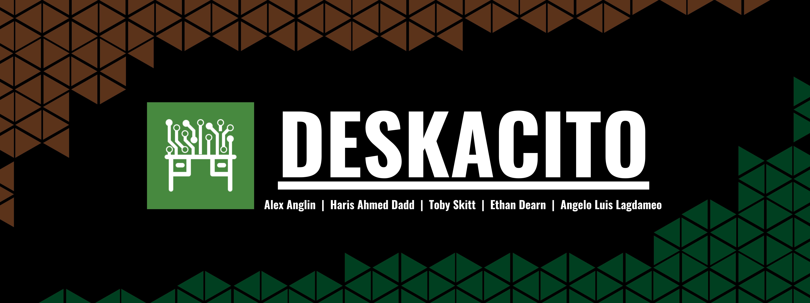

  

### <ins>Project Name:</ins>
Deskacito - Smart Desk Project for BCU Innovation Fest 2024

### <ins>Project Duration:</ins>
Jan 2024 - May 2024

### <ins>Members:</ins>
- Haris Ahmed Dadd
  - LinkedIn: https://www.linkedin.com/in/haris-ahmed-dadd/
- Ethan Dearn
  - LinkedIn: https://www.linkedin.com/in/ethan-dearn-682680273/
- Toby Skitt
  - LinkedIn: https://www.linkedin.com/in/toby-skitt/
- Alex Anglin
  - LinkedIn: https://www.linkedin.com/in/alex-anglin-4052102a7/
- Angelo Luis Lagdameo
  - LinkedIn: www.linkedin.com/in/angelo-luis-lagdameo

# What is this Project?
Deskacito is education-based project that has been developed as part of the Innovation Project Module of the BSc Computer Science course at Birmingham City University. In the span of January to May of 2024, a team of four first-year undergraduate students at the time devised the idea of developing on the current design and functions of the modern day desk by creating a "Smart Desk" that would help benefit the current environment of a work office in order to enhance the levels of productivity being within it, as well as attempting to eliminate the possibility of work theft from occurring through the utilization and implementation of a mixture of hardware and software for certain features.

  

## Features
(Pending Description)

# Media and Content
- Watch the original [video presentation](https://youtu.be/1dtRnUoHcjs?feature=shared) of the project idea.
- Watch the [vlog](https://youtu.be/lGv-NvLEX-M?feature=shared) in relation to the project development.
